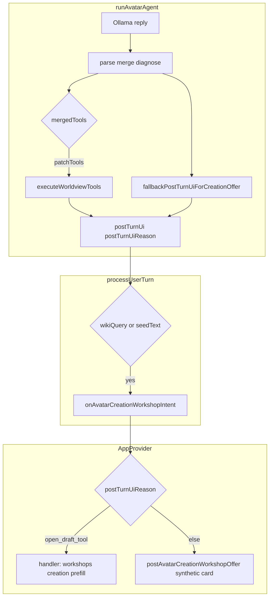

# Avatars avatar creation (chat) and workshop trace

## When to use

- User asks to **create / make / build** an **avatar**, **persona**, or **character** in **normal chat** (not necessarily the platform task queue).
- Expanded prompt shows **"(none — no valid avatars_tools_v1 envelope)"** or **Parse mismatch hints**.
- **Parsed tool names** vs **Executed tools** disagree or both show **(none)**.
- **Workshops → Creation** does not open or **prefill** (`wikiQuery` / `seedText`) is wrong or empty.
- In-thread copy like **"I prepared an avatar creation draft…"** but the wrong follow-up (no workshop, duplicate offer, etc.).

## Scope boundary

This skill covers **single-turn chat → `runAvatarAgent` → `avatars.workshop.open_draft` → `postTurnUi` → shell (AppProvider / `useAppContentModel`)**.

For **durable platform projects/tasks**, multi-subject queues, **Context → Tasks**, **`avatarCreationTaskExecution`**, and **complex task planner** synthetic cards, use [.cursor/skills/avatars-platform-projects-tasks/SKILL.md](../avatars-platform-projects-tasks/SKILL.md).

For **repeated tool resolution errors** (especially missing args after a tool is chosen), use [.cursor/skills/avatars-tool-error-self-repair/SKILL.md](../avatars-tool-error-self-repair/SKILL.md).

For **filing regressions** and TEST_PLAN evidence rows, use [.cursor/skills/avatars-reported-issues/SKILL.md](../avatars-reported-issues/SKILL.md).

---

## Trace map (read in order)

1. **User message → intent and prompt shape**
   - [`detectTurnToolIntent`](../../../src/services/turnToolIntent.ts) — e.g. `creation` for “make an avatar …”.
   - [`resolveToolProfile`](../../../src/services/agenticTools/toolProtocol.ts) + [`renderToolProtocol`](../../../src/services/agenticTools/toolProtocol.ts) — when `creation` + `open_draft` allowed, profile is **`creation`** with a strong example block.
   - [`formatOllamaClosingInstruction`](../../../src/services/behaviorTuningFormat.ts) — **`toolMandateSuffix`** adds the extra line mandating a trailing ` ```json ` **`avatars_tools_v1`** block for **`avatars.workshop.open_draft`** when profile and intent align.

2. **Model reply → parse**
   - [`splitWorldviewToolsFromReply`](../../../src/services/worldviewTools/parse.ts), lexical merge, [`diagnoseWorldviewToolReply`](../../../src/services/worldviewTools/diagnose.ts).
   - Protocol overview: [docs/AGENTIC_TOOLS.md](../../../docs/AGENTIC_TOOLS.md).

3. **Repair gate (common pitfall)**
   - In [`runAvatarAgent`](../../../src/services/avatarAgents.ts), **`needsRepair`** is true only when **`mergedTools.length === 0`** **and** **`parseDiagnosis.hints.length > 0`** (among other conditions).
   - **Plain prose** with no fences and no “malformed tool” patterns often yields **zero hints** → repair **does not** run even if the user clearly asked for creation.

4. **Execute**
   - [`partitionWorldviewTools`](../../../src/services/gmailFetchTools.ts) — **`avatars.workshop.open_draft`** is **not** a Gmail fetch tool; it stays in **`patchTools`**.
   - [`executeWorldviewTools`](../../../src/services/worldviewTools/execute.ts) — `open_draft` validates args then returns **ok** (no durable side effect beyond validation).

5. **postTurnUi and reasons**
   - [`postTurnUiFromOpenDraftTools`](../../../src/services/avatarAgents.ts) — builds **`navigateAvatarCreationWorkshop`** from successful **`open_draft`** results.
   - [`fallbackPostTurnUiForCreationOffer`](../../../src/services/avatarAgents.ts) — when there is no workshop intent from tools yet, **`turnIntent === "creation"`**, and the avatar may use **`open_draft`**, supplies **`postTurnUi`** and canned visible text for generic / question-shaped model replies; sets **`postTurnUiReason`** to values like **`creation_generic_reply_fallback`**, **`creation_open_question_fallback`**, **`creation_auto_offer`**, or **`open_draft_tool`** when intent already came from executed tools.

6. **Turn completion → hook**
   - [`processUserTurn`](../../../src/store/appStore.ts) **`onAvatarComplete`**: calls **`onAvatarCreationWorkshopIntent`** only if **`wikiQuery`** or **`seedText`** is non-empty after trim on **`result.postTurnUi.navigateAvatarCreationWorkshop`**.

7. **UI routing**
   - [`AppProvider`](../../../src/context/AppProvider.tsx) **`onAvatarCreationWorkshopIntent`**: if **`postTurnUiReason === "open_draft_tool"`** and [`avatarCreationWorkshopIntentHandlerRef`](../../../src/context/AppProvider.tsx) is set, invokes the same callback registered by **`registerAvatarCreationWorkshopIntentHandler`** (opens **Workshops → Creation** and sets prefill in [`useAppContentModel`](../../../src/app/useAppContentModel.ts)). Otherwise posts a synthetic offer via [`postAvatarCreationWorkshopOffer`](../../../src/services/avatarCreationOffer.ts) (card with **Open draft** / **Refine** / **Not now**), which uses [`setAvatarCreationOfferOpenHandler`](../../../src/services/avatarCreationOffer.ts) — the **same** handler ref when the content model registers.

---

## Flow (high level)



---

## Symptom → likely layer

| What you see | Likely focus |
|----------------|--------------|
| Parsed **(none)**, no parse mismatch hints, creation phrasing | **`needsRepair`** not firing (hints empty); mandate / **`toolProfile`** / **`turnIntent`**; model ignoring protocol |
| Parse mismatch hints, still no tools after repair | Repair prompt / model; [`diagnoseWorldviewToolReply`](../../../src/services/worldviewTools/diagnose.ts) patterns |
| Parsed **`open_draft`**, Executed **(none)** or resolution errors | Permission / args — [`executeWorldviewTools`](../../../src/services/worldviewTools/execute.ts), [`avatarMayUseAgenticTool`](../../../src/services/agenticTools/registry.ts); see **avatars-tool-error-self-repair** |
| Executed **`open_draft`**, no workshop navigation | **`processUserTurn`** trim gate; **`AppProvider`** branch (**`postTurnUiReason`**, handler ref null); offer-only path |
| Canned **“I prepared…”** + offer card, Executed **(none)** | **`fallbackPostTurnUiForCreationOffer`** path; compare **`postTurnUiReason`** to **`open_draft_tool`** |

---

## Tests and fixtures

- Integration: [`avatarAgents.toolUse.integration.test.ts`](../../../src/services/avatarAgents.toolUse.integration.test.ts) — parse, repair, fallback vs substantive replies.
- Golden replies: [`src/services/worldviewTools/__fixtures__/modelReplies/`](../../../src/services/worldviewTools/__fixtures__/modelReplies/).
- Manual / catalog: [`docs/TEST_PLAN.md`](../../../docs/TEST_PLAN.md) (e.g. **A7**, **A14**).

---

## Verification

After changing this pipeline, run **`npm run verify`** and a short smoke per [.cursor/skills/avatars-capability-smoke/SKILL.md](../avatars-capability-smoke/SKILL.md).
