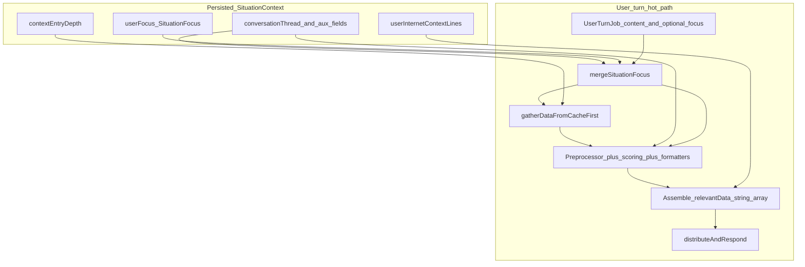

# Avatars: context, sources, and Focus

## When to use

- Editing **Context** UI ([`src/app/ContextPanel.tsx`](../../../src/app/ContextPanel.tsx)), Focus rows, depth sliders, or Internet pinning.
- Tracing a **user turn**: what gets into the prompt vs what stays diagnostic-only.
- Changing **[`processUserTurn`](../../../src/store/appStore.ts)** or anything that builds **`relevantData`**.
- Working on **platform gather/cache** ([`gatherDataFromCacheFirst`](../../../src/services/platform/cachedSources.ts), [`sourceCache`](../../../src/services/platform/sourceCache.ts)).
- Extending **connector output**, **context scoring**, or **preprocessor** caps.
- Disambiguating **“sources”** (connector/cache path) from **`replySource`** on avatar messages (where the reply came from).

## Mental model (one turn)

**Order of ideas:** persisted choices (Focus, depth, pinned web lines) plus the live user message drive **`processUserTurn`**. That function merges Focus, reads **cached connector snapshots** (sources), ranks and formats connector rows into lines, then concatenates fixed-prefix blocks (WoS, profile, `focus:` strings, projects, …) and **appends pinned internet lines verbatim** into **`relevantData`**. The switchboard and avatar agents consume that same **`SituationContext`** instance (with the new **`relevantData`**) for the wave.

## Quick glossary

| Term | Meaning |
|------|--------|
| **Situation Context** | `SituationContext` in [`src/types/index.ts`](../../../src/types/index.ts): conversation thread, optional per-turn **`relevantData`**, **`userFocus`**, **`userInternetContextLines`**, **`contextEntryDepth`**, WoS fields, behavior tuning, proactive notification fields, world-metadata-related UI state, etc. Some fields are **ephemeral** (rebuilt or cleared each turn; see `replyToUserMessageId`, `turnEmailFetchAllowlist`, `lastEmailRankingDiagnostics`, … in type comments). |
| **Focus** | **`SituationFocus`** stored as **`userFocus`**: optional **`email`**, **`calendar`**, **`contact`**, **`project`** ([`FocusItem`](../../../src/types/index.ts) id + title, optional snippet on mail). Encoded for prompts via **`focusToRelevanceStrings`** in [`situationContext.ts`](../../../src/services/situationContext.ts) → lines like `focus: email [id] title`. Also steers **gather** (`includeEmail` / `includeContacts` when those focus slots are set), preprocessor caps, scoring bonuses, and project detail blocks—not only those prefix lines. |
| **Internet pins** | **`userInternetContextLines`**: formatted strings from Context → Internet; merged into **`relevantData`** each turn **without** connector-style scoring ([`internetContextLines.ts`](../../../src/services/internetContextLines.ts)). The Focus panel lists them with an **Internet:** label; they are **not** fields inside **`SituationFocus`**. |
| **Sources (this codebase)** | **Connector-backed data** aggregated for a turn: read **cache-first** in **`gatherDataFromCacheFirst`**, with per-source fallback notes when cache is empty ([`cachedSources.ts`](../../../src/services/platform/cachedSources.ts)). **Not** the same as per-message **`replySource`** on [`AvatarAgentResult`](../../../src/types/index.ts). |
| **`relevantData`** | `string[]`: primary “what is relevant right now” channel for avatars. Built in **`processUserTurn`** ([`appStore.ts`](../../../src/store/appStore.ts)); roughly: WoS (if enabled), user profile lines, focus strings, project metadata lines, platform project block, scored email/calendar/contact lines, other connector lines via **`dataToRelevanceStringsWithoutEmail`**, then **`userInternetContextLines`**. |
| **Context depth** | **`contextEntryDepth`** sliders (per tab) → **`resolveContextEntryBudgets`** ([`contextEntryBudget.ts`](../../../src/utils/contextEntryBudget.ts)) → caps such as email/calendar/contacts/projects top-K and max web hits per search run. |
| **Proactive** | Separate evaluation path for **new** items (e.g. email) → pending notifications; reuses scoring ideas but is not the same array as user-turn **`relevantData`** assembly. Overview: [`docs/CONTEXT_SCORING.md`](../../../docs/CONTEXT_SCORING.md). |

## Where in the repo

| Concern | Where |
|--------|--------|
| Types, persisted shape | [`src/types/index.ts`](../../../src/types/index.ts) (`SituationContext`, `SituationFocus`, `ContextEntryDepth`) |
| Focus strings + merge helper | [`src/services/situationContext.ts`](../../../src/services/situationContext.ts) (`focusToRelevanceStrings`, `mergeSituationFocus`) |
| Turn assembly | [`src/store/appStore.ts`](../../../src/store/appStore.ts) (`processUserTurn`, **`relevantData`** array) |
| Cache-first gather | [`src/services/platform/cachedSources.ts`](../../../src/services/platform/cachedSources.ts), [`sourceCache.ts`](../../../src/services/platform/sourceCache.ts) |
| Depth → budgets | [`src/utils/contextEntryBudget.ts`](../../../src/utils/contextEntryBudget.ts) |
| Context UI | [`src/app/ContextPanel.tsx`](../../../src/app/ContextPanel.tsx); view model wiring [`src/app/useAppContentModel.ts`](../../../src/app/useAppContentModel.ts) (`setFocus` → `patchSituationContext({ userFocus })`) |
| Scoring / formatting | [`src/services/contextScoring/`](../../../src/services/contextScoring/), plus email/calendar/contact helpers invoked from **`processUserTurn`** |
| Scoring concepts | [`docs/CONTEXT_SCORING.md`](../../../docs/CONTEXT_SCORING.md) and per-source docs linked there |
| Targeted search / Internet tab | [`docs/TARGETED_SEARCH.md`](../../../docs/TARGETED_SEARCH.md), [`src/services/internetContextLines.ts`](../../../src/services/internetContextLines.ts) |
| Preprocessor vs corpus | [`docs/WORLD_MODEL_AND_PREPROCESSOR.md`](../../../docs/WORLD_MODEL_AND_PREPROCESSOR.md) |

## Common pitfalls

1. **“Sources” vs `replySource`** — In conversations about **context**, *sources* means **connector/cache aggregated data** feeding **`relevantData`**. **`replySource`** on an avatar result describes **how that reply was produced** (model vs rules vs fallback), not Gmail/cache rows.

2. **Internet lines skip scoring** — **`userInternetContextLines`** are appended verbatim after scored blocks. Do not expect **`CONTEXT_SCORING`** rules to rank them; treat them as user-authored context.

3. **Focus box mixes two mechanisms** — UI shows **`SituationFocus`** rows (email/calendar/contact/project) **and** pinned internet lines. **`Clear`** in the Focus header clears **`userFocus`** **and** **`userInternetContextLines`** ([`ContextPanel.tsx`](../../../src/app/ContextPanel.tsx)). Individual row buttons clear one slot or one pinned line.

4. **`mergeSituationFocus(job.focus, ctx.userFocus)`** — Queued jobs can carry focus; job fields win per-field when present. When debugging “wrong focus,” check both persisted **`userFocus`** and the **job** payload.

5. **Gather gates email and contacts on Focus** — **`processUserTurn`** passes **`includeEmail: Boolean(effectiveFocus.email?.id)`** and **`includeContacts: Boolean(effectiveFocus.contact?.id)`**. Without those focus slots, **`gatherDataFromCacheFirst`** returns **empty** email/contacts arrays for that turn (availability notes explain why). **Calendar** still loads from cache when a snapshot exists ([`cachedSources.ts`](../../../src/services/platform/cachedSources.ts)).

## Out of scope here

- Full scoring formulas and affinity math: use **`docs/CONTEXT_SCORING*.md`**.
- Detailed switchboard routing: see [`switchboard.ts`](../../../src/services/switchboard.ts) after you understand **`relevantData`** assembly.
