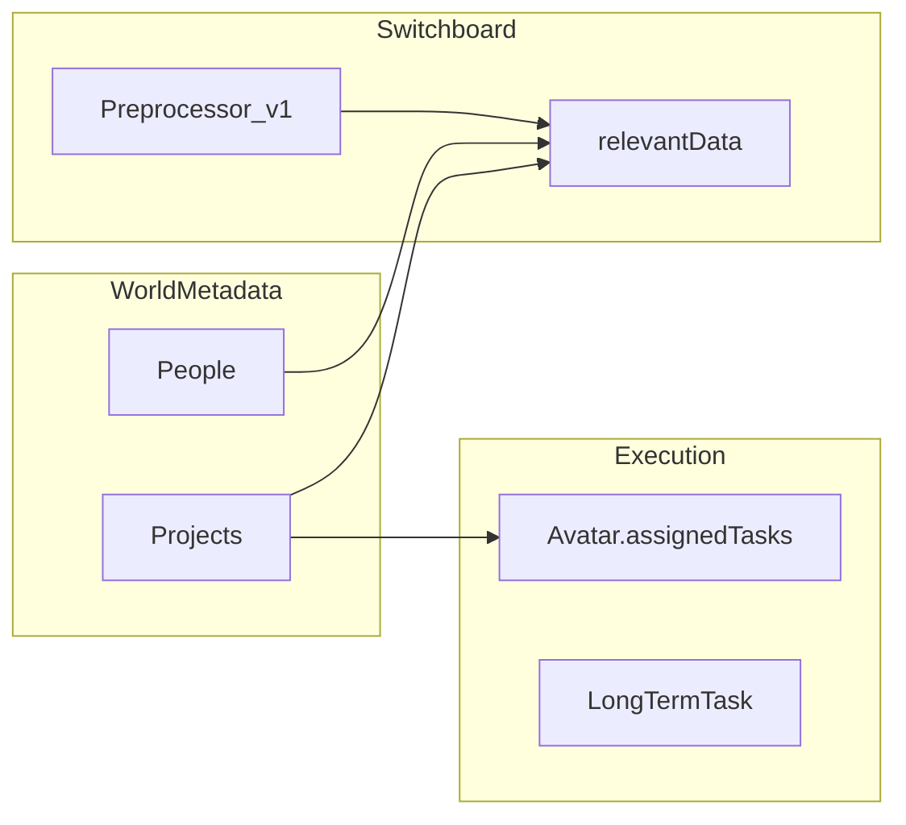
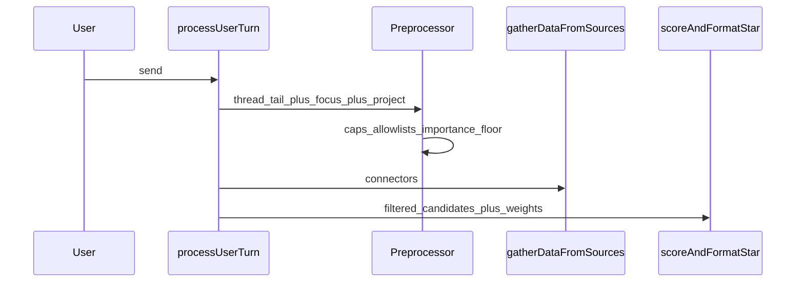

# World model and preprocessor (design direction)

**Non-normative.** Working design for the next implementation phase. Canonical requirements remain in [SPEC.md](../SPEC.md). See also [IMPLEMENTATION_ROADMAP.md](IMPLEMENTATION_ROADMAP.md) Phases B–D.

---

## Goals

- **Shared understanding:** Avatars and the user contribute to a **persistent world model** centered on **Projects** (real-world efforts to gather context for—not only “tasks” in the UI sense).
- **Tasks vs projects:** A **Project** groups narrative + structured facts and may contain **many** **tasks**. **Tasks** remain the execution grain (`Avatar.assignedTasks`, `LongTermTask`). Terminology: [STYLEGUIDE.md](STYLEGUIDE.md) § Project / Task.
- **Adaptive relevance:** User **importance** rankings (contacts, calendar events, topics) so the app can **down-rank or omit** unremarkable items.
- **Lean prompts:** A **preprocessor** step after the user sends a message and **before** heavy **context scoring** reduces what enters `relevantData` (tokens + latency).

SQLite/Tauri on-disk persistence for metadata is **out of scope** until SPEC/Techspec commit; **world metadata v1** in `localStorage` ([`worldMetadata/`](../src/services/worldMetadata/)) is the current foundation.

---

## World model anchor: Projects

**Existing types:** [`WorldMetadataDoc`](../src/services/worldMetadata/types.ts) includes `projects: Record<string, ProjectMetadataRecord>` with `title`, `notes`, `updatedAt`. **People** overlays exist; Projects are not yet first-class in chat routing.

**Suggested phased implementation**

1. **Schema (non-breaking first):** Extend `ProjectMetadataRecord` with optional **summary** for prompts, optional **links** to task ids / avatar ids, timestamps as needed.
2. **UI surface:** Minimal “current project” or project picker; inject **one project block** into `relevantData` in [`processUserTurn`](../src/store/appStore.ts) (same pattern as WoS / focus).
3. **Avatar contributions:** Short-term: append structured or human-readable lines to `notes` or a `contributions[]` log from hooks after turns; later, dedicated agent steps.
4. **`assignedTasks` bridge:** When tasks reference a **`projectId`**, prompts and routing can align with “work on project X.”

---

## User importance (contacts, events, topics)

- **Storage:** Extend [`PersonMetadataRecord`](../src/services/worldMetadata/types.ts) (and add a parallel map for **calendar/event ids** or **topic keys** as needed) with an **ordinal or score** (“importance”).
- **Use in scoring:** In [`contextScoring/`](../src/services/contextScoring/) apply **hard filters** (below threshold → omit) or **soft caps** on score contribution. Align thresholds with SPEC **importance tiers** for proactive where sensible.

---

## Email body (examination)

**Implemented behavior (user turn):** Ranked connector lines include each message’s **Gmail id** (`email [id …]` in [`contextScoring/email.ts`](../src/services/contextScoring/email.ts)) so prompts and tools can refer to a specific thread item. [`processUserTurn`](../src/store/appStore.ts) **fetches** the focused message body **before** ranking so a **capped excerpt** can enrich the scoring corpus, then injects the full body as an `Email body [id]:` block. Up to two additional bodies prefetch for **strong-match** rows (`normFocus` ≥ threshold). Avatars may also request **`gmail.fetch_message_body`** in the `avatars_tools_v1` JSON block for any Gmail message id that appears in the **loaded inbox** snapshot for that turn (allowlist = all `data.email` ids plus focus, de-duplicated); the host runs a **single follow-up** Ollama pass with the fetched bodies injected when reads succeed. [`formatRelevantDataForOllamaPrompt`](../src/services/relevantContextPrompt.ts) **truncates** oversized body blocks for the Ollama payload. See [CONTEXT_SCORING_EMAIL.md](CONTEXT_SCORING_EMAIL.md) for scoring details.

---

## Preprocessor (after user prompt, before scoring)

**Insert** a narrow, deterministic stage in [`processUserTurn`](../src/store/appStore.ts) **after** the user message is in the thread and **before** assembling the large `relevantData` blob (or immediately after `gatherDataFromSources` if the preprocessor only **filters ids**).

**Inputs:** Thread tail, `userFocus`, optional current project, world metadata snippets.

**Outputs (implemented v1):** [`runUserTurnPreprocessor`](../src/services/preprocessor/userTurnPreprocessor.ts) returns `{ maxEmails, maxCalendar, maxContacts, emailThreadTail, calendarThreadTail, contactThreadTail }` — caps shrink for very short user messages; **project focus** slightly raises email/calendar caps; **email-only focus** (email set, calendar not) **raises** email K by one (capped) and **tightens** calendar/contact K to reduce noise when the user is clearly mail-centric. **No** extra LLM call.

**Why:** Importance + optional body fetch attach here so the system does not **score** dozens of emails when only a handful matter.

---

## Agentic roadmap (later)

Stronger **Project agents**, autonomous gathering, and summarization are **not** prerequisites for schema + UI + preprocessor **v1**; document extension points when implementing hooks.
