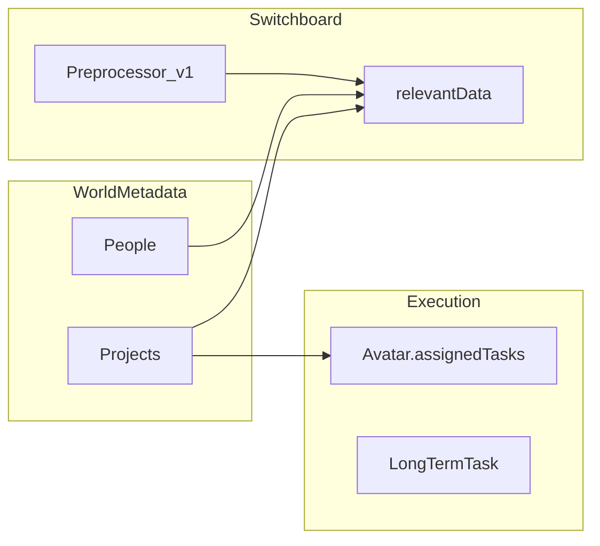
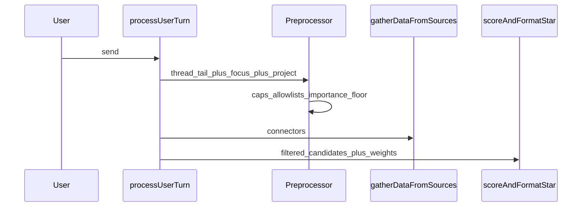

# World model and preprocessor (design direction)

**Non-normative.** Working design for the next implementation phase. Canonical requirements remain in [SPEC.md](../SPEC.md). See also [IMPLEMENTATION_ROADMAP.md](IMPLEMENTATION_ROADMAP.md) Phases B–D.

---

## Goals

- **Shared understanding:** Avatars and the user contribute to a **persistent world model** centered on **Projects** (real-world efforts to gather context for—not only “tasks” in the UI sense).
- **Tasks vs projects:** A **Project** groups narrative + structured facts and may contain **many** **tasks**. **Tasks** remain the execution grain (`Avatar.assignedTasks`, `LongTermTask`). Terminology: [STYLEGUIDE.md](STYLEGUIDE.md) § Project / Task.
- **Adaptive relevance:** User **importance** rankings (contacts, calendar events, topics) so the app can **down-rank or omit** unremarkable items.
- **Lean prompts:** A **preprocessor** step after the user sends a message and **before** heavy **context scoring** reduces what enters `relevantData` (tokens + latency).

SQLite/Tauri on-disk persistence for metadata is **out of scope** until SPEC/Techspec commit; **world metadata v1** in `localStorage` ([`worldMetadata/`](../src/services/worldMetadata/)) is the current foundation.

---

## World model anchor: Projects

**Existing types:** [`WorldMetadataDoc`](../src/services/worldMetadata/types.ts) includes `projects: Record<string, ProjectMetadataRecord>` with `title`, `notes`, `updatedAt`. **People** overlays exist. **UI — editing the local projects list:** use **Workshops → Projects** in the main chat column (see [WORKSHOPS.md](./WORKSHOPS.md)); the Context panel no longer hosts a Projects tab. **Projects — partial bridge today:** ids are synced into the **platform** project store ([`platform/store.ts`](../src/services/platform/store.ts) under [`services/platform/`](../src/services/platform/)) for stewardship / scheduler / context blocks; [`LongTermTask`](../src/services/longTermTasks.ts) rows (with `projectId`) and [`routingScore.ts`](../src/services/routingScore.ts) tie user-turn routing to project titles; [`projectAvatarLink.ts`](../src/services/projectAvatarLink.ts) links world-metadata patches and the Assign-task UI to long-term tasks and per-row steward `ownerAvatarId`. Deeper “projects hub” and preprocessor-first-class treatment remain roadmap; see [PROGRESS.md](../PROGRESS.md).

**Suggested phased implementation**

1. **Schema (non-breaking first):** Extend `ProjectMetadataRecord` with optional **summary** for prompts, optional **links** to task ids / avatar ids, timestamps as needed.
2. **UI surface:** Minimal “current project” or project picker; inject **one project block** into `relevantData` in [`processUserTurn`](../src/store/appStore.ts) (same pattern as WoS / focus).
3. **Avatar contributions:** Short-term: append structured or human-readable lines to `notes` or a `contributions[]` log from hooks after turns; later, dedicated agent steps.
4. **`assignedTasks` bridge:** When tasks reference a **`projectId`**, prompts and routing can align with “work on project X.”

**Workflow state contract:** Platform tasks are the execution grain for autonomous / cooperative work. A task may record a richer `workflowStatus`, `nextActor`, `requiredCapability`, `approval`, `blockers`, and `completionEvidence` in the durable platform store while the legacy `status` remains the compatibility field for scheduler and existing UI paths. Local project/task metadata changes are allowed autonomously; external side effects, private data access, destructive actions, and user-only steps must be represented as approval, missing capability, or `waiting_for_user` state instead of being executed silently. `LongTermTask` remains a thin stewardship / routing view; do not put the rich workflow state there unless the platform store has already changed.

**Complex task handling priority:** The next project-execution step is task splitting. A broad user request should create or update a **Project** that captures the goal and then produce one or more execution **Tasks** with owners, required capabilities, and completion criteria. For example, “create three named avatars” should become one avatar-creation project plus three per-avatar tasks. Each task can run research, form-fill, review, and save steps independently. This keeps the **Project** as the durable context while the **Task** is the unit that an avatar, steward, or future background agent can actually complete.

**Complex Task Monitor:** Before durable tasks are created, complex requests can produce monitor-style review cards, using `monitor:unassigned_projects` as the UI model. The card should expose the proposed plan graph, discovered candidates, requirements that are not yet satisfied, and user actions such as **Create tasks**, **Edit list**, **Search members**, **Ask avatars to suggest plan**, and **Skip**. The default path is deterministic orchestration; Ollama can enrich fuzzy planning or avatar suggestions, but it should not be the required gate before lexical splits, candidate review, or task creation.

**Typed plan vocabulary:** Keep the first plan graph small and inspectable:

- `discover_set` — identify a bounded candidate set from a phrase or source query.
- `review_candidates` — show candidates for user acceptance, removal, or correction.
- `repeat_for_each` — run the same child sequence for each accepted item.
- `research_item` — gather supporting source evidence for one accepted item.
- `fill_avatar_form` — populate one avatar-creation draft from evidence and defaults.
- `await_user_approval` — stop before durable mutations or external side effects that need explicit consent.

Examples:

- “Create avatars named A, B, C” can use a direct lexical split and `repeat_for_each` without model planning.
- “Create avatars for the main crew of Firefly” should use `discover_set`, `review_candidates`, then `repeat_for_each` with per-member `research_item` and `fill_avatar_form` steps.

Tool misuse should feed this loop. If a steward avatar emits the wrong tool shape or tries to use a capability it does not currently qualify for, record the telemetry, then decide whether the next success condition is (1) clearer prompt/tool eligibility, (2) capability assignment, (3) request decomposition, or (4) user approval / input. The fix should not be limited to parser repair when the user intent is genuinely multi-step.

**Gating language:** The preprocessor / monitor layer should express valid execution paths as success conditions. A plan step proceeds when the required project context, task owner, capability, source evidence, and approval state are present. Missing requirements become task state and review-card copy. This avoids making negative commands the main control mechanism and makes the user-facing path easier to inspect.

---

## User importance (contacts, events, topics)

- **Storage:** Extend [`PersonMetadataRecord`](../src/services/worldMetadata/types.ts) (and add a parallel map for **calendar/event ids** or **topic keys** as needed) with an **ordinal or score** (“importance”).
- **Use in scoring:** In [`contextScoring/`](../src/services/contextScoring/) apply **hard filters** (below threshold → omit) or **soft caps** on score contribution. Align thresholds with SPEC **importance tiers** for proactive where sensible.

---

## Email body (examination)

**Implemented behavior (user turn):** Ranked connector lines include each message’s **Gmail id** (`email [id …]` in [`contextScoring/email.ts`](../src/services/contextScoring/email.ts)) so prompts and tools can refer to a specific thread item. [`processUserTurn`](../src/store/appStore.ts) **fetches** the focused message body **before** ranking so a **capped excerpt** can enrich the scoring corpus, then injects the full body as an `Email body [id]:` block. Up to two additional bodies prefetch for **strong-match** rows (`normFocus` ≥ threshold). Avatars may also request **`gmail.fetch_message_body`** in the `avatars_tools_v1` JSON block for any Gmail message id that appears in the **loaded inbox** snapshot for that turn (allowlist = all `data.email` ids plus focus, de-duplicated); the host runs a **single follow-up** Ollama pass with the fetched bodies injected when reads succeed. [`formatRelevantDataForOllamaPrompt`](../src/services/relevantContextPrompt.ts) **truncates** oversized body blocks for the Ollama payload. See [CONTEXT_SCORING_EMAIL.md](CONTEXT_SCORING_EMAIL.md) for scoring details.

---

## Preprocessor (after user prompt, before scoring)

**Insert** a narrow, deterministic stage in [`processUserTurn`](../src/store/appStore.ts) **after** the user message is in the thread and **before** assembling the large `relevantData` blob (or immediately after `gatherDataFromSources` if the preprocessor only **filters ids**).

**Inputs:** Thread tail, `userFocus`, optional current project, world metadata snippets.

**Outputs (implemented v1):** [`runUserTurnPreprocessor`](../src/services/preprocessor/userTurnPreprocessor.ts) returns `{ maxEmails, maxCalendar, maxContacts, emailThreadTail, calendarThreadTail, contactThreadTail }` — caps shrink for very short user messages; **project focus** slightly raises email/calendar caps; **email-only focus** (email set, calendar not) **raises** email K by one (capped) and **tightens** calendar/contact K to reduce noise when the user is clearly mail-centric. **No** extra LLM call.

**Why:** Importance + optional body fetch attach here so the system does not **score** dozens of emails when only a handful matter.

---

## Agentic roadmap (later)

Stronger **Project agents**, autonomous gathering, and summarization are **not** prerequisites for schema + UI + preprocessor **v1**; document extension points when implementing hooks. The near-term priority is narrower: split complex user goals into platform tasks, route by capability/stewardship, and keep the user-visible project context coherent.
